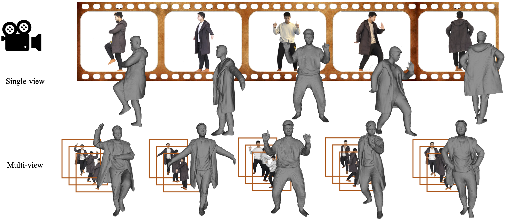
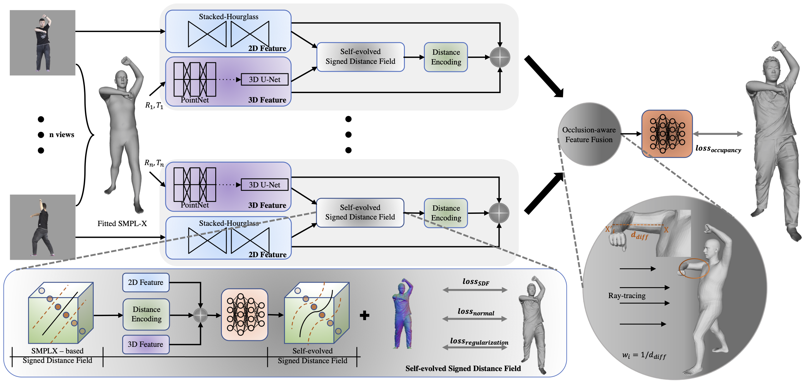

<div align="center">

# SeSDF: Self-evolved Signed Distance Field for Implicit 3D Clothed Human Reconstruction

<a href="https://yukangcao.github.io/">Yukang Cao</a>, <a href="https://www.kaihan.org/">Kai Han</a>, <a href="https://i.cs.hku.hk/~kykwong/">Kwan-Yee K. Wong</a>

[](https://arxiv.org/abs/2304.00359)
<a href="https://yukangcao.github.io/SeSDF/"></a>



Please refer to our webpage for more visualizations.
</div>

## Abstract
We address the problem of clothed human reconstruction from a single image or uncalibrated multi-view images. Existing methods struggle with reconstructing detailed geometry of a clothed human and often require a calibrated setting for multi-view reconstruction. We propose a flexible framework which, by leveraging the parametric SMPL-X model, can take an arbitrary number of input images to reconstruct a clothed human model under an uncalibrated setting. At the core of our framework is our novel self-evolved signed distance field (SeSDF) module which allows the framework to learn to deform the signed distance field (SDF) derived from the fitted SMPL-X model, such that detailed geometry reflecting the actual clothed human can be encoded for better reconstruction. Besides, we propose a simple method for self-calibration of multi-view images via the fitted SMPL-X parameters. This lifts the requirement of tedious manual calibration and largely increases the flexibility of our method. Further, we introduce an effective occlusion-aware feature fusion strategy to account for the most useful features to reconstruct the human model. We thoroughly evaluate our framework on public benchmarks, and our framework establishes a new state-of-the-art.




## Environment configuration

The environment (in conda `yaml`) for `SeSDF` training and testing.
```
conda env create -f environment_sesdf.yaml
conda activate sesdf
```
You may also need to install `torch_scatter` manually for the 3D encoder
```
pip install torch==1.10.0+cu102 torchvision==0.11.0+cu102 torchaudio==0.10.0 -f https://download.pytorch.org/whl/torch_stable.html
pip install torch-scatter==2.0.9 -f https://pytorch-geometric.com/whl/torch-1.10.0+cu102.html
```
If you are using RTX 3090 or higher, please install `torch`, `torchvision`, and `torch-scatter` correspondingly, i.e.,
```
pip install torch==1.10.0+cu111 torchvision==0.11.1+cu111 torchaudio==0.10.0 -f https://download.pytorch.org/whl/torch_stable.html
pip install torch-scatter==2.0.9 -f https://pytorch-geometric.com/whl/torch-1.10.0+cu111.html
```
Follow [pytorch3d](https://github.com/facebookresearch/pytorch3d/blob/main/INSTALL.md) and [kaolin](https://kaolin.readthedocs.io/en/latest/notes/installation.html) to install the required package.

## Dataset preprocessing

We use `THUman2.0` dataset for training and testing. You can download it and corresponding SMPL-X parameters and meshes from [this link](https://github.com/ytrock/THuman2.0-Dataset) after following the instruction and sending the request form.

1. Generating the [precomputed radiance transfer (PRT)](https://sites.fas.harvard.edu/~cs278/papers/prt.pdf) for each obj mesh as in instructed in `PIFu`:
```
cd process_data
python -m prt_util -i {path_to_THUman2.0_dataset}
```

2. Rendering the meshes into 360-degree images. Together with `RENDER` folder for images, it will generate the `MASK`, `PARAM`, `UV_RENDER`, `UV_MASK`, `UV_NORMAL`, `UV_POS`, and copy the meshes to `GEO/OBJ`. Remember to add -e to enable EGL rendering.
```
python -m render_data -i {path_to_THUman2.0_dataset} -o {path_to_THUman2.0_processed_for_training} -e
cd ..
```

After data preprocessing, the dataset directory would be like:
```
THU2_processed/
├── UV_RENDER
├── UV_POS
├── UV_NORMAL
├── UV_MASK
├── PARAM
├── MASK
├── GEO/OBJ
├── SMPLX
├── val.txt
```

## Training

Training the single-view pipeline (The intermediate results and checkpoints are saved under ./results and ./checkpoints respectively.)
```
cd ./single-view
python -m apps.train_shape --dataroot {path_to_processed_THUman2.0_processed} --random_flip --random_scale --num_stack 4 --num_hourglass 2 --resolution 512 --hg_down 'ave_pool' --norm 'group' --val_train_error --val_test_error --gpu_ids=0,1,2 --batch_size 3 --learning_rate 0.0001 --sigma 0.02 --checkpoints_path {your_checkpoints_folder} --results_path {your_results_folder} --schedule 4 --num_threads 10
```

Training the multi-view pipeline
```
cd ../multi-view
python -m apps.train_shape --dataroot {path_to_processed_THUman2.0_processed} --random_flip --random_scale --num_stack 4 --num_hourglass 2 --resolution 512 --hg_down 'ave_pool' --norm 'group' --val_train_error --val_test_error --gpu_id=0 --batch_size 1 --learning_rate 0.0001 --sigma 0.02 --checkpoints_path {your_checkpoints_folder} --results_path {your_results_folder} --schedule 4 --num_threads 10 --num_views 3
```

See {your_results_folder}/pred.ply for intermediate visualizations during training.

## Inference 🚧

Testing with the single-view pipeline (we follow a similar approach in [ICON](https://github.com/YuliangXiu/ICON/tree/master) to obtain the estimated SMPL-X model.)
```
python ./apps/eval.py --batch_size 1 --num_stack 4 --num_hourglass 2 --resolution 512 --hg_down 'ave_pool' --norm 'group' --norm_color 'group' --test_folder_path {path_to_your_testdata} --load_netG_checkpoint_path {path_to_your_netG_checkpoint}
```


## Misc.
If you want to cite our work, please use the following bib entry:
```
@inproceedings{cao2023sesdf,
author    = {Yukang Cao and Kai Han and Kwan-Yee K. Wong},
title     = {SeSDF: Self-evolved Signed Distance Field for Implicit 3D Clothed Human Reconstruction},
booktitle = {IEEE Conference on Computer Vision and Pattern Recognition (CVPR)},
year      = {2023},
}
```
